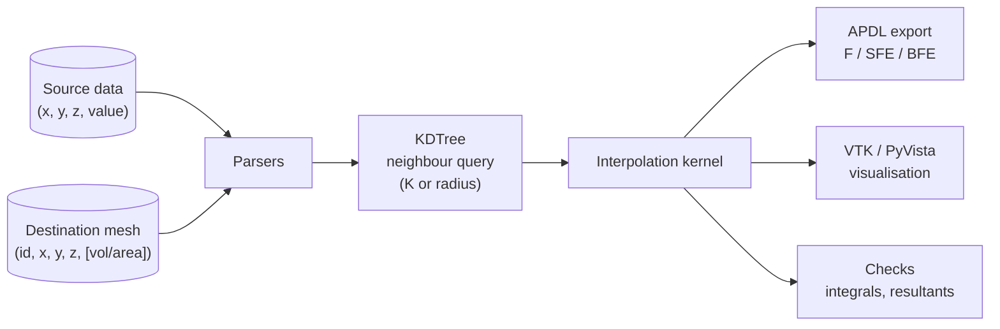

# InterpCore

**InterpCore** is a Python library for interpolating physical field data
(electromagnetic forces, heat flux, heat generation, convection boundary conditions)
from a *source* point cloud onto a *destination* mechanical mesh, and for exporting
the result directly as ANSYS APDL load commands.

-   :lucide-rocket: **Getting started**

    ---

    Install the package and run your first interpolation in a few lines.

    [:octicons-arrow-right-24: Quick start](getting-started.md)

-   :lucide-git-compare-arrows: **Interpolation kernels**

    ---

    Source-to-target and target-to-source kernels, with the maths behind them.

    [:octicons-arrow-right-24: Kernels](user-guide/kernels.md)

-   :lucide-zap: **Load types**

    ---

    EM forces, heat flux, heat generation and HTC with their APDL output format.

    [:octicons-arrow-right-24: Load types](user-guide/load-types.md)

-   :lucide-notebook-pen: **Examples**

    ---

    Complete Jupyter notebook workflows with sample data and PyVista plots.

    [:octicons-arrow-right-24: Examples](examples/index.md)

## Features

- **Multiple interpolation kernels**: distance-weighted, FEM-based, average,
  weighted average, closest point.
- **Flexible neighbour search**: K-nearest neighbours or radius-based, with a hard
  `max_distance` cut-off and coincident-node detection.
- **Multiple load types**: EM forces (3-component vectors), heat flux, heat generation
  and Heat Transfer Coefficient + bulk temperature.
- **Analysis tools**: scalar field integration and EM force/moment resultants to
  validate conservation.
- **Export to ANSYS APDL**: one ready-to-read command file per source file.
- **Visualisation**: VTK output for ParaView or PyVista.
- **Efficient**: KDTree-based spatial queries and optional multithreading.

## License

Licensed under the
[European Union Public Licence (EUPL) 1.2](https://github.com/Fusion4Energy/InterpCore/blob/main/LICENSE).
Developed by the F4E mechanical team.
