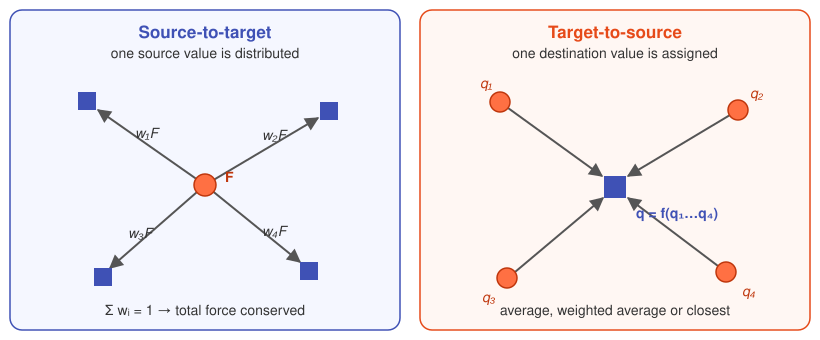
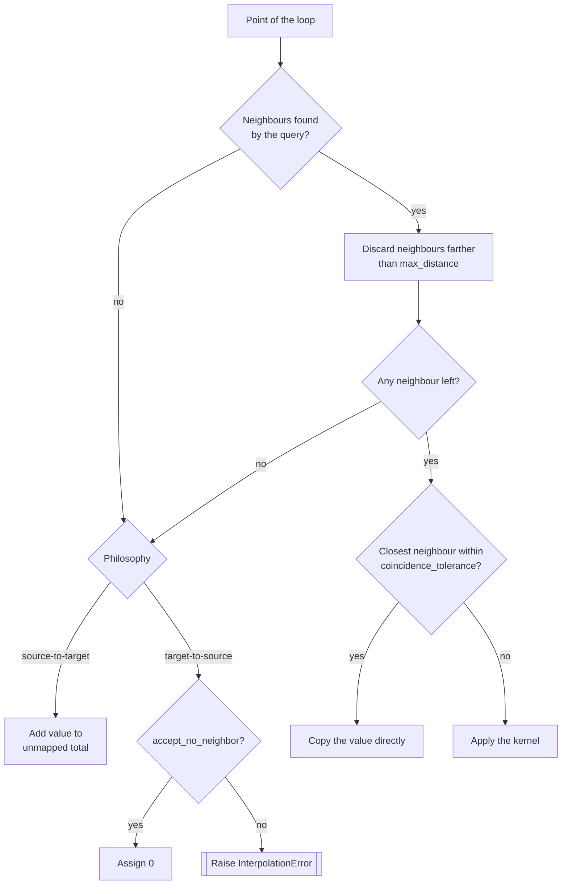

# How it works

## Overview

InterpCore maps values known on a **source** point cloud (e.g. the integration points
of an electromagnetic or CFD model) onto a **destination** point set (the nodes or the
element centroids of a mechanical FE model).
The neighbour query is computed only once, in the constructor, since all source files
are assumed to share the same coordinates.

## Two mapping philosophies

Kernels fall into two families, depending on which point set the KDTree is built on
and on which point set the loop runs.

{ .diagram }

Orange circles are source points, blue squares are destination points.

| | Source-to-target | Target-to-source |
|---|---|---|
| KDTree built on | destination points | source points |
| Loop over | source points | destination points |
| Each iteration | **distributes** one source value to its destination neighbours | **assigns** one destination value from its source neighbours |
| Contributions | accumulate (`+=`) | assigned once (`=`) |
| Conserves | the total (sum) of the field | the local intensity of the field |
| Kernels | `DISTANCE_WEIGHTED`, `FEM` | `AVERAGE`, `AVERAGE_WEIGHTED`, `CLOSEST` |
| Loads | `EM_FORCE` | `HEAT_FLUX`, `HEAT_GEN`, `HTC` |

Forces are *extensive* quantities: the sum of the nodal forces must equal the total
force of the source, so each source force is split among the destination nodes.
Heat flux, heat generation and HTC are *intensive* quantities (densities): each
destination point must receive a representative local value, regardless of how many
source points are nearby.

## Per-point decision flow

For every point of the loop, the following logic is applied
(see [`interpolate_block`](../api/kernels.md)):

!!! warning "Unmapped values"
    With source-to-target kernels, a source point with no destination neighbour within
    `max_distance` is not lost silently: its value is added to an `unmapped` total,
    reported by [`compute_EM_resultants`](analysis.md#em-force-resultants) as
    `Unmapped_EM_Force`.
