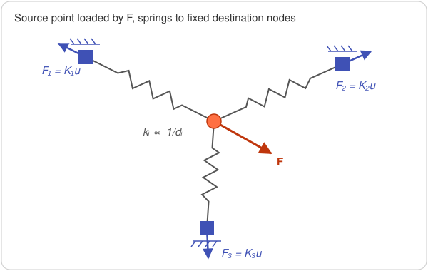

# Interpolation kernels

The kernel defines how the value of a point is computed from its neighbourhood, once
the neighbours have been found by the [query](query-methods.md) and filtered by
`max_distance`. Kernels belong to one of two
[families](how-it-works.md#two-mapping-philosophies).

In the following, $d_i$ is the distance between the current point and its $i$-th
neighbour, and $N$ is the number of neighbours.

## Inverse distance weights

`DISTANCE_WEIGHTED` and `AVERAGE_WEIGHTED` use normalised inverse distance weights:

$$
w_i = \frac{1/d_i}{\sum_{j=1}^{N} 1/d_j}, \qquad \sum_{i=1}^{N} w_i = 1
$$

The closer the neighbour, the larger its weight.

## Source-to-target kernels

Each source point distributes its value $\mathbf{F}$ to its destination neighbours.
The contributions coming from different source points are summed on each destination
node.

### `DISTANCE_WEIGHTED`

$$
\mathbf{F}_i \mathrel{+}= w_i\,\mathbf{F}
$$

Since the weights sum to one, the total force is conserved exactly. Each component is
split independently, so the direction of every nodal contribution is the same as the
direction of $\mathbf{F}$.

### `FEM`

The source point is connected to each of its destination neighbours by an axial
spring with stiffness inversely proportional to its length, with the destination
nodes fixed. The force $\mathbf{F}$ is applied to the source point and the reaction
forces of the springs are the nodal forces.

{ .diagram }

With $\mathbf{e}_i$ the unit vector from the source point to neighbour $i$:

$$
\mathbf{K}_i = \frac{1}{d_i}\,\mathbf{e}_i\,\mathbf{e}_i^{\mathsf T},
\qquad
\Big(\sum_{i=1}^{N}\mathbf{K}_i\Big)\,\mathbf{u} = \mathbf{F},
\qquad
\mathbf{F}_i = \mathbf{K}_i\,\mathbf{u}
$$

The nodal forces sum to $\mathbf{F}$, so the total force is conserved. Unlike
`DISTANCE_WEIGHTED`, each nodal force is aligned with its spring, so the distribution
depends on the geometry of the neighbourhood.

!!! warning
    The $3\times3$ stiffness matrix is singular when all neighbours are aligned or
    coplanar with the source point (e.g. very few neighbours or a 2D-like
    neighbourhood). In that case no force is distributed for that source point.
    Use enough neighbours (K ≥ 4 is a reasonable minimum) to avoid it, and check the
    [resultants](analysis.md#em-force-resultants).

## Target-to-source kernels

Each destination point receives a value $q$ computed from the values $q_j$ of its
source neighbours.

### `AVERAGE`

$$
q = \frac{1}{N}\sum_{j=1}^{N} q_j
$$

### `AVERAGE_WEIGHTED`

$$
q = \sum_{j=1}^{N} w_j\, q_j
$$

### `CLOSEST`

$$
q = q_{k}, \qquad k = \arg\min_j d_j
$$

The value of the closest source neighbour is copied. This is useful when source and
destination points are close to each other, or when sharp gradients should not be
smoothed.

## Kernel–load compatibility { #kernel-load-compatibility }

| Kernel | Family | Compatible loads |
|---|---|---|
| `DISTANCE_WEIGHTED` | Source-to-target | `EM_FORCE` |
| `FEM` | Source-to-target | `EM_FORCE` |
| `AVERAGE` | Target-to-source | `HEAT_FLUX`, `HEAT_GEN`, `HTC` |
| `AVERAGE_WEIGHTED` | Target-to-source | `HEAT_FLUX`, `HEAT_GEN`, `HTC` |
| `CLOSEST` | Target-to-source | `HEAT_FLUX`, `HEAT_GEN`, `HTC` |

Using an incompatible combination raises a `ConfigurationError` when the
`InterpolationConfig` is created.
