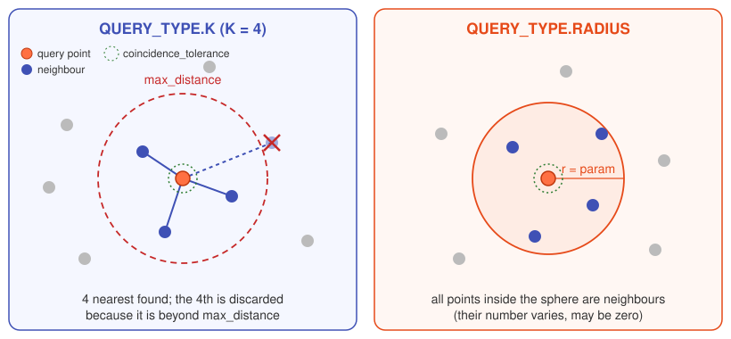

# Query methods

Before interpolating, the neighbours of each point are searched with a
[KDTree](https://scikit-learn.org/stable/modules/generated/sklearn.neighbors.KDTree.html).
Which point set the tree is built on depends on the
[kernel family](how-it-works.md#two-mapping-philosophies).

{ .diagram }

## `QUERY_TYPE.K`

Returns the `param` nearest neighbours (`param` must be an integer). It always returns
exactly K points, even if some are very far: use `max_distance` to discard them.

## `QUERY_TYPE.RADIUS`

Returns all neighbours within a sphere of radius `param`. The number of neighbours
varies from point to point and can be zero.

## Filters applied after the query

`max_distance`
:   Neighbours farther than `max_distance` are discarded. With `QUERY_TYPE.RADIUS`
    it is effective only when smaller than the radius.

`coincidence_tolerance`
:   If the neighbour is closer than this tolerance, the two points are considered
    coincident and the value is copied directly, skipping the kernel.

!!! tip "Choosing the parameters"
    - `max_distance` should be a few times the typical spacing of the coarser of the
      two point sets: big enough to always find a neighbour, small enough not to pick
      points from a different part of the geometry.
    - `coincidence_tolerance` should be much smaller than the mesh size, e.g. a
      fraction of the smallest element.
